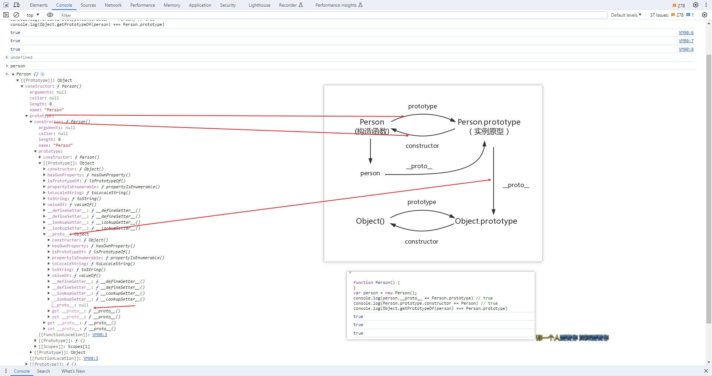

# 原型链

## 什么是原型链？

- 用于实现对象之间的共享和继承。每个 JavaScript 对象都有一个内部的[[Prototype]]属性，它是一个隐藏属性，指向另一个对象。当访问一个对象的属性或方法时，如果该对象自身没有该属性或方法，JavaScript 引擎会沿着该对象的原型链向上查找，直到找到该属性或方法或找到 Object.prototype 为止。如果最终在 Object.prototype 上仍然找不到该属性或方法，则会返回 undefined

### 原型

- 每个构造函数都有一个原型对象，原型对象都包含一个指向构造函数的指针，而实例都包含一个指向原型对象的内部指针

### 原型链

- 假如我们让原型对象等于另一个类型的实例，此时的原型对象将包含一个指向另一个原型的指针，相应地，另一个原型中也包含着一个指向另一个构造函数的指针。 假如另一个原型又是另一个类型的实例，那么上述关系依然成立，如此层层递进，就构成了实例与原型的链条。这就是所谓的原型链的基本概念。

### 特点

- 创建的每一个函数都有一个 prototype（原型）属性，这个属性是一个指针，指向一个对象，即原型对象
- prototype 就是通过调用构造函数而创建的那个对象实例的原型对象，这个实例内部含有的指向原型对象的指针叫[[Prototype]]
- 默认情况下，所有原型对象都会自动获得一个 constructor（构造函数）属性，这个属性是一个指向 prototype 属性所在函数的指针
- 所有函数的默认原型都是 Object 的实例，因此默认原型都会包含一个内部指针，指向 Object.prototype

## 原型链解决了什么问题？

- MDN 原描述

> 当谈到继承时，JavaScript 只有一种结构：对象。每个对象（object）都有一个私有属性指向另一个名为原型（prototype）的对象。原型对象也有一个自己的原型，层层向上直到一个对象的原型为 null。根据定义，null 没有原型，并作为这个原型链（prototype chain）中的最后一个环节。可以改变原型链中的任何成员，甚至可以在运行时换出原型，因此 JavaScript 中不存在静态分派的概念。

> 尽管这种混杂通常被认为是 JavaScript 的弱点之一，但是原型继承模型本身实际上比类式模型更强大。例如，在原型模型的基础上构建类式模型（即类的实现方式）相当简单。

## 代码演示

```javascript
function Person() {}

// 虽然写在注释⾥，但是你要注意：
// prototype是函数才会有的属性
Person.prototype.name = "ZiJieYuan";
var person1 = new Person();
var person2 = new Person();
console.log(person1.name); // ZiJieYuan
console.log(person2.name); // ZiJieYuan
```

## 原型链关系图



