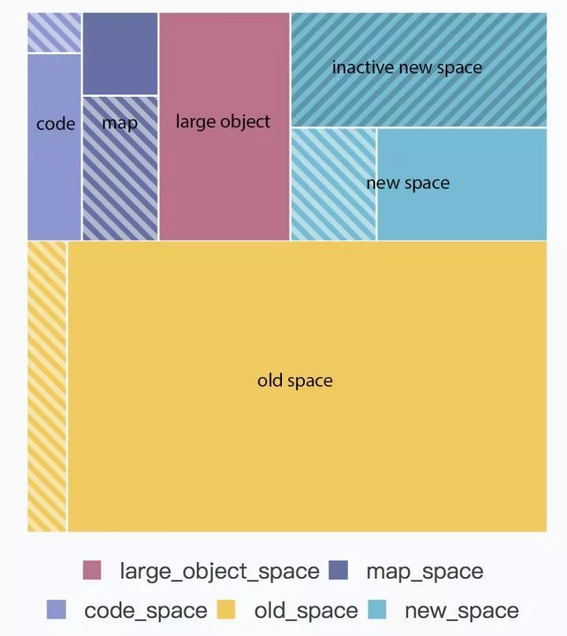

# V8 引擎垃圾回收

## 为何需要垃圾回收

- 在 V8 引擎逐行执行 JavaScript 代码的过程中，当遇到函数的情况时，会为其创建一个函数执行上下文(Context)环境并添加到调用堆栈的栈顶，
- 函数的作用域(handleScope)中包含了该函数中声明的所有变量，
- 当该函数执行完毕后，对应的执行上下文从栈顶弹出，函数的作用域会随之销毁，其包含的所有变量也会统一释放并被自动回收。
- 试想如果在这个作用域被销毁的过程中，其中的变量不被回收，即持久占用内存，那么必然会导致内存暴增，
- 从而引发内存泄漏导致程序的性能直线下降甚至崩溃，因此内存在使用完毕之后理当归还给操作系统以保证内存的重复利用

## V8 引擎的内存限制

- V8 引擎在 64 位系统下最多只能使用约 1.4GB 的内存，在 32 位系统下最多只能使用约 0.7GB 的内存

- `那么为什么会有这种限制？`
  1. `JS 单线程机制：`垃圾回收的过程阻碍了主线程逻辑的执行，V8 执行垃圾回收时，程序中的其他各种逻辑都要进入暂停等待阶段
  2. `垃圾回收机制耗时：`假设 V8 的堆内存为 1.5G，那么 V8 做一次小的垃圾回收需要 50ms 以上，而做一次非增量式回收甚至需要 1s 以上，而在这 1s 的时间内，浏览器一直处于等待的状态，同时会失去对用户的响应

> 基于以上两点，V8 引擎为了减少对应用的性能造成的影响，采用了一种比较粗暴的手段，那就是直接限制堆内存的大小，毕竟在浏览器端一般也不会遇到需要操作几个 G 内存这样的场景

## V8 的垃圾回收策略

### V8 的内存结构

| 内存区域                     | 描述                                                                                                                                                                                                                                               |
| ---------------------------- | -------------------------------------------------------------------------------------------------------------------------------------------------------------------------------------------------------------------------------------------------- |
| 新生代(new_space)            | 大多数的对象开始都会被分配在这里，该区域相对较小但是垃圾回收特别频繁。该区域被分为两半，一半用来分配内存，另一半用于在垃圾回收时将需要保留的对象复制过来。                                                                                         |
| 老生代(old_space)            | 新生代中的对象在存活一段时间后就会被转移到老生代内存区，相对于新生代该内存区域的垃圾回收频率较低。老生代又分为老生代指针区和老生代数据区，前者包含大多数可能存在指向其他对象的指针的对象，后者只保存原始数据对象，这些对象没有指向其他对象的指针。 |
| 大对象区(large_object_space) | 存放体积超越其他区域大小的对象，每个对象都会有自己的内存，垃圾回收不会移动大对象区。                                                                                                                                                               |
| 代码区(code_space)           | 代码对象会被分配在这里，是唯一拥有执行权限的内存区域。                                                                                                                                                                                             |
| map 区(map_space)            | 存放 Cell 和 Map，每个区域都是存放相同大小的元素，结构简单。                                                                                                                                                                                       |

## 新生代 垃圾回收

- 主要采用了 Scavenge 算法。

- 在 Scavenge 算法的具体实现中，主要采用了 Cheney 算法，
- 它将新生代内存一分为二，每一个部分的空间称为 semispace，也就是我们在上图中看见的 new_space 中划分的两个区域，
- 其中处于激活状态的区域我们称为 From 空间，未激活(inactive new space)的区域我们称为 To 空间。
- 这两个空间中，始终只有一个处于使用状态，另一个处于闲置状态。
- 我们的程序中声明的对象首先会被分配到 From 空间，当进行垃圾回收时，
- 如果 From 空间中尚有存活对象，则会被复制到 To 空间进行保存，非存活的对象会被自动回收。
- 当复制完成后，From 空间和 To 空间完成一次角色互换，To 空间会变为新的 From 空间，原来的 From 空间则变为 To 空间。

### 流程图

- 假设在老生代中有 A、B、C、D 四个对象 
  

- 在垃圾回收的标记阶段，将对象 A 和对象 C 标记为活动的
  

- 在垃圾回收的整理阶段，将活动的对象往堆内存的一端移动
  

- 在垃圾回收的清除阶段，将活动对象左侧的内存全部回收
  

### 注意：对象晋升

- 当一个对象在经过多次复制之后依旧存活，那么它会被认为是一个生命周期较长的对象，
- 在下一次进行垃圾回收时，该对象会被直接转移到老生代中，这种对象从新生代转移到老生代的过程我们称之为晋升。
  > 对象晋升的条件主要有以下两个：
  >  对象是否经历过一次 Scavenge 算法
  >  To 空间的内存占比是否已经超过 25%

## 老生代 垃圾回收

- 在老生代中，因为管理着大量的存活对象，如果依旧使用 Scavenge 算法的话，很明显会浪费一半的内存，因此已经不再使用 Scavenge 算法
- 采用新的算法 Mark-Sweep(标记清除)和 Mark-Compact(标记整理)来进行管理。

### Mark-Sweep(标记清除)

- 分为标记和清除两个阶段，在标记阶段会遍历堆中的所有对象，
- 然后标记活着的对象，在清除阶段中，会将死亡的对象进行清除。
- Mark-Sweep 算法主要是通过判断某个对象是否可以被访问到，从而知道该对象是否应该被回收；
- 具体步骤如下：
  1. 垃圾回收器会在内部构建一个根列表，用于从根节点出发去寻找那些可以被访问到的变量。比如在 JavaScript 中，window 全局对象可以看成一个根节点。
  2. 然后，垃圾回收器从所有根节点出发，遍历其可以访问到的子节点，并将其标记为活动的，根节点不能到达的地方即为非活动的，将会被视为垃圾。
  3. 最后，垃圾回收器将会释放所有非活动的内存块，并将其归还给操作系统。

### Mark-Compact(标记整理)

- Mark-Sweep 算法存在一个问题，就是在经历过一次标记清除后，内存空间可能会出现不连续的状态，因为我们所清理的对象的内存地址可能不是连续的，所以就会出现内存碎片的问题，导致后面如果需要分配一个大对象而空闲内存不足以分配，就会提前触发垃圾回收，而这次垃圾回收其实是没必要的，因为我们确实有很多空闲内存，只不过是不连续的。

- 为了解决这种内存碎片的问题，Mark-Compact(标记整理)算法被提了出来，该算法主要就是用来解决内存的碎片化问题的，回收过程中将死亡对象清除后，在整理的过程中，会将活动的对象往堆内存的一端进行移动

- 假设在老生代中有 A、B、C、D 四个对象 
  

- 在垃圾回收的标记阶段，将对象 A 和对象 C 标记为活动的
  

- 在垃圾回收的整理阶段，将活动的对象往堆内存的一端移动
  

- 在垃圾回收的清除阶段，将活动对象左侧的内存全部回收
  

### Incremental Marking(增量标记) 优化

- 由于 JS 的单线程机制，垃圾回收的过程会阻碍主线程同步任务的执行，待执行完垃圾回收后才会再次恢复执行主任务的逻辑，这种行为被称为全停顿(stop-the-world)。
- 如果在标记阶段将整个堆内存遍历一遍，那么势必会造成严重的卡顿
- 为了减少垃圾回收带来的停顿时间，V8 引擎又引入了 Incremental Marking(增量标记)的概念
- 即将原本需要一次性遍历堆内存的操作改为增量标记的方式，先标记堆内存中的一部分对象，
- 然后暂停，将执行权重新交给 JS 主线程，待主线程任务执行完毕后再从原来暂停标记的地方继续标记，直到标记完整个堆内存。

- 得益于增量标记的好处，V8 引擎后续继续引入了延迟清理(lazy sweeping)和增量式整理(incremental compaction)，
- 让清理和整理的过程也变成增量式的。同时为了充分利用多核 CPU 的性能，也将引入并行标记和并行清理，进一步地减少垃圾回收对主线程的影响，为应用提升更多的性能

## 参考文献

- https://juejin.cn/post/6844904016325902344
