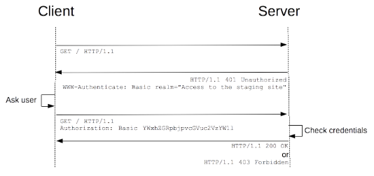

# 前端鉴权

## 鉴权 - HTTP Basic Authentication

### 认证过程

1. 客户端向服务器请求数据，假设客户端尚未被验证，
2. 服务器向客户端发送验证请求代码 401,（WWW-Authenticate: Basic realm=”google.com”这句话是关键，如果没有客户端不会弹出用户名和密码输入界面）服务器返回的数据大抵如下：
3. 当符合 http1.0 或 1.1 规范的客户端（如 IE，FIREFOX）收到 401 返回值时，将自动弹出一个登录窗口，要求用户输入用户名和密码
4. 用户输入用户名和密码后，将用户名及密码以 BASE64 加密方式加密，并将密文放入前一条请求信息中

## 鉴权 - session-cookie

### 认证过程

1. 服务器在接受客户端首次访问时在服务器端创建 seesion，然后保存 seesion，然后给这个 session 生成一个唯一的标识字符串,然后在响应头中种下这个唯一标识字符串。
2. 签名。这一步只是对 sid 进行加密处理，服务端会根据这个 secret 密钥进行解密。（非必需步骤）
3. 浏览器中收到请求响应的时候会解析响应头，然后将 sid 保存在本地 cookie 中，浏览器在下次 http 请求头中会带上该域名下的 cookie 信息。
4. 服务器在接受客户端请求时会去解析请求头 cookie 中的 sid，然后根据这个 sid 去找服务器端保存的该客户端的 session，然后判断该请求是否合法。
5. 一旦用户登出，服务端和客户端同时销毁该会话在后续请求中，服务器会根据数据库验证会话 id，如果验证通过，则继续处理；

## 鉴权 - Token 验证

### 认证过程

1. 用户输入登陆凭据；
2. 服务器验证凭据是否正确，然后返回一个经过签名的 token；
3. 客户端负责存储 token，可以存在 localstorage，或者 cookie 中
4. 对服务器的请求带上这个 token；
5. 服务器对 JWT 进行解码，如果 token 有效，则处理该请求；
6. 一旦用户登出，客户端销毁 token

## 鉴权 - OAuth(开放授权)

### OAuth 的思路

- OAuth 在"客户端"与"服务提供商"之间，设置了一个授权层（authorization layer）。"客户端"不能直接登录"服务提供商"，只能登录授权层，以此将用户与客户端区分开来。"客户端"登录授权层所用的令牌（token），与用户的密码不同。用户可以在登录的时候，指定授权层令牌的权限范围和有效期。

- "客户端"登录授权层以后，"服务提供商"根据令牌的权限范围和有效期，向"客户端"开放用户储存的资料

### 认证过程

1. 客户端（第三方软件）向 OAUTH 服务提供商请求未授权的 RequestToken。即向 RequestToken URL 发起请求；
2. OAUTH 服务提供商同意使用者的请求，并向其颁发未经用户授权的 oauth_token 与对应的 oauth_token_secret，并返回给使用者；
3. 使用者向 OAUTH 服务提供商请求用户授权的 RequestToken。即向 UserAuthorization URL 发起请求并在请求中携带上一步服务提供商颁发的未授权的 token 与其密钥；
4. OAUTH 服务提供商通过网页要求用户登录并引导用户完成授权；
5. RequestToken 授权后，使用者将向 AccessToken URL 发起请求，将上步授权的 RequestToken 换取成 AccessToken。请求的参数见上图，这个比第一步多了一个参数就是 RequestToken；
6. OAUTH 服务提供商同意使用者的请求，并向其颁发 AccessToken 与对应的密钥，并返回给使用者；
7. 使用者以后就可以使用上步返回的 AccessToken 访问用户授权的资源。

### OAuth 2.0 四种获得令牌的流程

- `授权码：`指的是第三方应用先申请一个授权码，然后再用该码获取令牌；`功能最完整、流程最严密的授权模式`

  > （A）用户访问客户端，后者将前者导向认证服务器。  
  > （B）用户选择是否给予客户端授权。  
  > （C）假设用户给予授权，认证服务器将用户导向客户端事先指定的"重定向 URI"> （redirection URI），同时附上一个授权码。  
  > （D）客户端收到授权码，附上早先的"重定向 URI"，向认证服务器申请令牌。这一步是在客户端的后台的服务器上完成的，对用户不可见。  
  > （E）认证服务器核对了授权码和重定向 URI，确认无误后，向客户端发送访问令牌（access token）和更新令牌（refresh token）。  

- `隐藏式：`直接向前端颁发令牌

  > （A）客户端将用户导向认证服务器。 
  > （B）用户决定是否给于客户端授权。 
  > （C）假设用户给予授权，认证服务器将用户导向客户端指定的"重定向 URI"，并在 URI 的 Hash 部分包含了访问令牌。 
  > （D）浏览器向资源服务器发出请求，其中不包括上一步收到的 Hash 值。 
  > （E）资源服务器返回一个网页，其中包含的代码可以获取 Hash 值中的令牌。 
  > （F）浏览器执行上一步获得的脚本，提取出令牌。 
  > （G）浏览器将令牌发给客户端。 

- `密码式：`高度信任某个应用，RFC 6749 也允许用户把用户名和密码，直接告诉该应用

  > （A）用户向客户端提供用户名和密码。 
  > （B）客户端将用户名和密码发给认证服务器，向后者请求令牌。 
  > （C）认证服务器确认无误后，向客户端提供访问令牌。 

- `凭证式：`适用于没有前端的命令行应用，即在命令行下请求令牌
  > （A）客户端向认证服务器进行身份认证，并要求一个访问令牌。 
  > （B）认证服务器确认无误后，向客户端提供访问令牌。

### 更新令牌

- 令牌的有效期到了，如果让用户重新走一遍上面的流程，再申请一个新的令牌，很可能体验不好，而且也没有必要。OAuth 2.0 允许用户自动更新令牌。

- 具体方法是，B 网站颁发令牌的时候，一次性颁发两个令牌，一个用于获取数据，另一个用于获取新的令牌（refresh token 字段）。令牌到期前，用户使用 refresh token 发一个请求，去更新令牌

## cookie 与 taken 性能对比

1. sessionid 他只是一个唯一标识的字符串，服务端是根据这个字符串，来查询在服务器端保持的 seesion，这里面才保存着用户的登陆状态。但是 token 本身就是一种登陆成功凭证，他是在登陆成功后根据某种规则生成的一种信息凭证，他里面本身就保存着用户的登陆状态。服务器端只需要根据定义的规则校验这个 token 是否合法就行。

2. session-cookie 是需要 cookie 配合的，居然要 cookie，那么在 http 代理客户端的选择上就是只有浏览器了，因为只有浏览器才会去解析请求响应头里面的 cookie,然后每次请求再默认带上该域名下的 cookie。但是我们知道 http 代理客户端不只有浏览器，还有原生 APP 等等，这个时候 cookie 是不起作用的，或者浏览器端是可以禁止 cookie 的，但是 token 就不一样，他是登陆请求在登陆成功后再请求响应体中返回的信息，客户端在收到响应的时候，可以把他存在本地的 cookie,storage，或者内存中，然后再下一次请求的请求头重带上这个 token 就行了。简单点来说 cookie-session 机制他限制了客户端的类型，而 token 验证机制丰富了客户端类型。

3. `时效性`：session-cookie 的 sessionid 实在登陆的时候生成的而且在登出事时一直不变的，在一定程度上安全就会低，而 token 是可以在一段时间内动态改变的

4. `可扩展性`：token 验证本身是比较灵活的，一是 token 的解决方案有许多，常用的是 JWT，二来我们可以基于 token 验证机制，专门做一个鉴权服务，用它向多个服务的请求进行统一鉴权。

## 参考文献

- [理解 OAuth 2.0](https://www.ruanyifeng.com/blog/2014/05/oauth_2_0.html)
- [OAuth 2.0 的四种方式](https://www.ruanyifeng.com/blog/2019/04/oauth-grant-types.html)
- [JSON Web Token 入门教程](https://www.ruanyifeng.com/blog/2018/07/json_web_token-tutorial.html)
- https://www.rfcreader.com/#rfc6749
