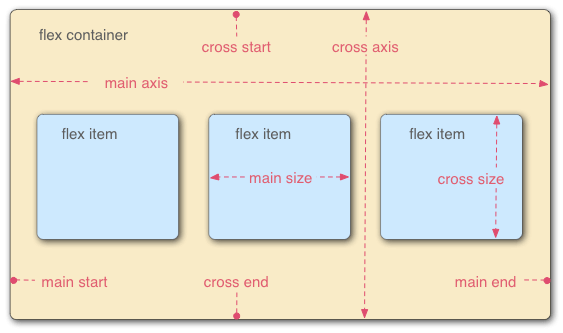

# Flex 布局

## Flex 布局是什么

- Flex 是 Flexible Box 的缩写，意为"弹性布局"，用来为盒状模型提供最大的灵活性。任何一个容器都可以指定为 Flex 布局

- `注意:`设为 Flex 布局以后，子元素的 float、clear 和 vertical-align 属性将失效

## 基本概念

- 采用 Flex 布局的元素，称为 `Flex 容器`（flex container），简称"容器"。
- 它的所有子元素自动成为容器成员，称为 `Flex 项目`（flex item），简称"项目"

- 容器默认存在两根轴：`水平的主轴`（main axis）和`垂直的交叉轴`（cross axis）。
- 主轴的开始位置（与边框的交叉点）叫做 `main start`，结束位置叫做 `main end`；
- 交叉轴的开始位置叫做 `cross start`，结束位置叫做 `cross end`
- 项目默认沿主轴排列。单个项目占据的主轴空间叫做 `main size`，占据的交叉轴空间叫做 `cross size`

## 容器的属性

1. **`flex-direction`**

   - flex-direction 属性决定主轴的方向（即项目的`排列方向`）
   - `row | row-reverse | column | column-reverse`
     | 属性值 | 主轴方向 | 起点位置 |
     | ---------------- | -------- | -------- |
     | `row`（默认值） | 水平方向 | 左端 |
     | `row-reverse` | 水平方向 | 右端 |
     | `column` | 垂直方向 | 上沿 |
     | `column-reverse` | 垂直方向 | 下沿 |

2. **`flex-wrap`**

   - 默认情况下，项目都排在一条线（又称"轴线"）上。flex-wrap 属性定义，如果一条轴线排不下，`如何换行`
   - `nowrap | wrap | wrap-reverse`
     | 属性值 | 换行行为 | 第一行位置 |
     | --- | --- | --- |
     | `nowrap`（默认） | 不换行 | 单行显示 |
     | `wrap` | 换行 | 第一行在上方 |
     | `wrap-reverse` | 换行 | 第一行在下方 |

3. **`flex-flow`**

   - flex-flow 属性是 flex-direction 属性和 flex-wrap 属性的`简写形式，默认值为 row nowrap`

4. **`justify-content`**

   - justify-content 属性定义了项目在`主轴上的对齐方式`
   - `flex-start | flex-end | center | space-between | space-around`
     | 属性值 | 对齐方式描述 |
     | ---------------------- | ---------------------------------------------------------- |
     | `flex-start`（默认值） | 左对齐（主轴起点方向） |
     | `flex-end` | 右对齐（主轴终点方向） |
     | `center` | 居中对齐 |
     | `space-between` | 两端对齐，项目之间的间隔相等 |
     | `space-around` | 每个项目两侧的间隔相等，项目与边框的间隔是项目间间隔的一半 |

5. **`align-items`**

   - align-items 属性定义项目在交叉轴上如何对齐
   - `flex-start | flex-end | center | baseline | stretch`
     | 属性值 | 对齐方式描述 |
     | --- | --- |
     | `flex-start` | 交叉轴起点对齐 |
     | `flex-end` | 交叉轴终点对齐 |
     | `center` | 交叉轴中点对齐 |
     | `baseline` | 项目的第一行文字的基线对齐 |
     | `stretch`（默认值） | 如果项目未设置高度或设为 `auto`，则占满整个容器的高度 |

6. **`align-content`**

   - align-content 属性定义了`多根轴线的对齐方式`。`如果项目只有一根轴线，该属性不起作用`
   - `flex-start | flex-end | center | space-between | space-around | stretch`

## 项目的属性

1. order

   - order 属性定义`项目的排列顺序`。数值越小，排列越靠前，默认为 0

2. flex-grow

   - flex-grow 属性定义`项目的放大比例`，默认为 0，即如果存在剩余空间，也不放大
   - `注意：`如果所有项目的 flex-grow 属性都为 1，则它们将等分剩余空间（如果有的话）。如果一个项目的 flex-grow 属性为 2，其他项目都为 1，则前者占据的剩余空间将比其他项`多一倍`

3. flex-shrink

   - flex-shrink 属性定义了`项目的缩小比例`，默认为 1，即如果空间不足，该项目将缩小
   - `注意：`如果所有项目的 flex-shrink 属性都为 1，当空间不足时，都将等比例缩小。如果一个项目的 flex-shrink 属性为 0，其他项目都为 1，则空间不足时，前者`不缩小`

4. flex-basis

   - flex-basis 属性定义了在分配多余空间之前，`项目占据的主轴空间`（main size）。浏览器根据这个属性，计算主轴是否有多余空间。它的默认值为 auto，即项目的本来大小。
   - 它可以设为跟 width 或 height 属性一样的值（比如 350px），则项目将占据固定空间

5. flex

   - flex 属性是 flex-grow, flex-shrink 和 flex-basis 的简写，默认值为 0 1 auto。后两个属性可选

6. align-self

   - align-self 属性允许单个项目有`与其他项目不一样的对齐方式`，可`覆盖 align-items 属性`。默认值为 auto，表示继承父元素的 align-items 属性，如果没有父元素，则等同于 stretch
   - `auto | flex-start | flex-end | center | baseline | stretch`
   - 除了 auto，其他都与 align-items 属性完全一致 F

## 参考文献

- [阮一峰 Flex 布局语法详解](https://ruanyifeng.com/blog/2015/07/flex-grammar.html)
- [阮一峰 Flex 布局实例演示](https://www.ruanyifeng.com/blog/2015/07/flex-examples.html)
