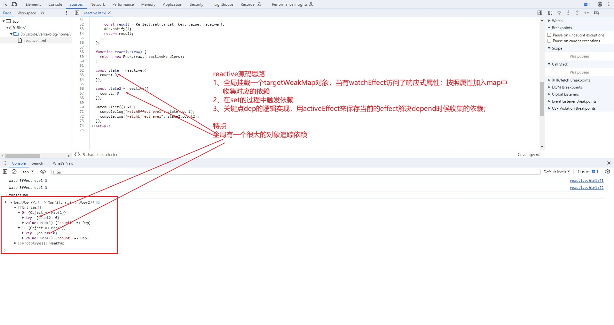

# reactive

## 最小的 dep 结构

```html
<script>
  // 关键点1：定义在全局，在depend的时候方便收集
  let activeEffect;
  class Dep {
    constructor(value) {
      this.subscribe = new Set();
      this._value = value;
    }
    depend() {
      if (activeEffect) {
        this.subscribe.add(activeEffect);
      }
    }
    notify() {
      this.subscribe.forEach((sub) => {
        sub();
      });
    }
    get value() {
      this.depend();
      return this._value;
    }
    set value(newValue) {
      this._value = newValue;
      this.notify();
    }
  }

  function watchEffect(effect) {
    activeEffect = effect;
    effect();
    activeEffect = null;
  }

  const dep = new Dep("init");

  watchEffect(() => {
    console.log(dep.value);
  });

  dep.value = "change";
</script>
```

## 最小 reactive 结构

```html
<script>
  // 关键点1：定义在全局，在depend的时候方便收集
  let activeEffect;
  class Dep {
    subscribe = new Set();
    depend() {
      if (activeEffect) {
        this.subscribe.add(activeEffect);
      }
    }
    notify() {
      this.subscribe.forEach((sub) => {
        sub();
      });
    }
  }

  function watchEffect(effect) {
    activeEffect = effect;
    effect();
    activeEffect = null;
  }

  // 关键点2：定义一个全局对象，解决不同的key如何指向同一个响应式对象问题
  const targetMap = new WeakMap();

  function getDep(target, key) {
    let depsMap = targetMap.get(target);
    if (!depsMap) {
      depsMap = new Map();
      targetMap.set(target, depsMap);
    }
    let dep = depsMap.get(key);
    if (!dep) {
      dep = new Dep();
      depsMap.set(key, dep);
    }

    return dep;
  }

  const reactiveHandlers = {
    get(target, key, receiver) {
      const dep = getDep(target, key);
      dep.depend();

      return Reflect.get(target, key, receiver);
    },
    set(target, key, value, receiver) {
      const dep = getDep(target, key);

      const result = Reflect.set(target, key, value, receiver);
      dep.notify();
      return result;
    },
  };

  function reactive(raw) {
    return new Proxy(raw, reactiveHandlers);
  }

  const state = reactive({
    count: 0,
  });

  watchEffect(() => {
    console.log("watchEffect evel", state.count);
  });
</script>
```

> 
