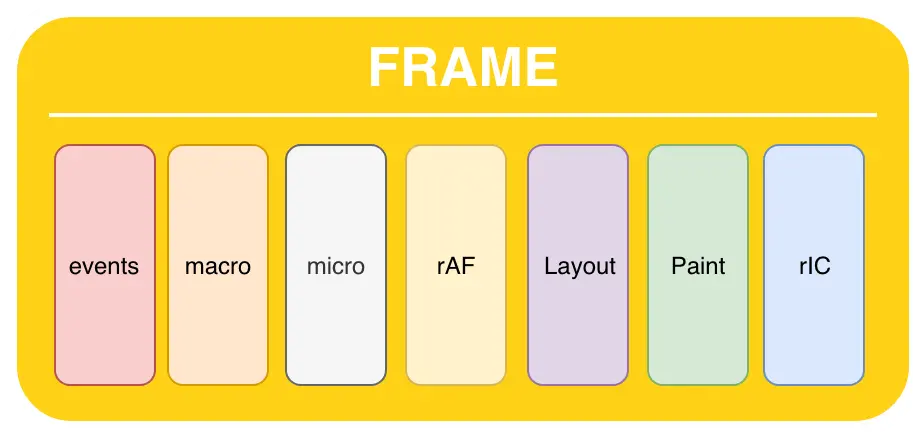

# requestIdleCallback

## requestIdleCallback 是什么

- window.requestIdleCallback() 方法插入一个函数，这个函数将在浏览器空闲时期被调用
- 这使开发者能够在主事件循环上执行后台和低优先级工作，而不会影响延迟关键事件，如动画和输入响应。
- 函数一般会按`先进先调用的顺序`执行，然而，如果回调函数指定了执行超时时间 timeout，则有可能为了在超时前执行函数而打乱执行顺



- events: 点击事件、键盘事件、滚动事件等
- macro: 宏任务，如 setTimeout
- micro: 微任务，如 Promise
- rAF: requestAnimationFrame
- Layout: CSS 计算，页面布局
- Paint: 页面绘制
- rIC: requestIdleCallback

## 看代码输出

```js
window.requestIdleCallback(
  () => {
    console.log(-1);
  },
  { timeout: 2000 }
);

window.requestAnimationFrame(() => {
  console.log(0);
});

async function async1() {
  console.log(1);
  await async2();
  console.log(3);
}

async function async2() {
  console.log(2);
}

async1();

setTimeout(() => console.log(4), 0);

new Promise((resolve) => {
  resolve();

  console.log(5);
}).then(() => {
  console.log(6);
  Promise.resolve().then(() => console.log(7));
});

console.log(8);
```

## 参考文献

- https://segmentfault.com/a/1190000019154514
