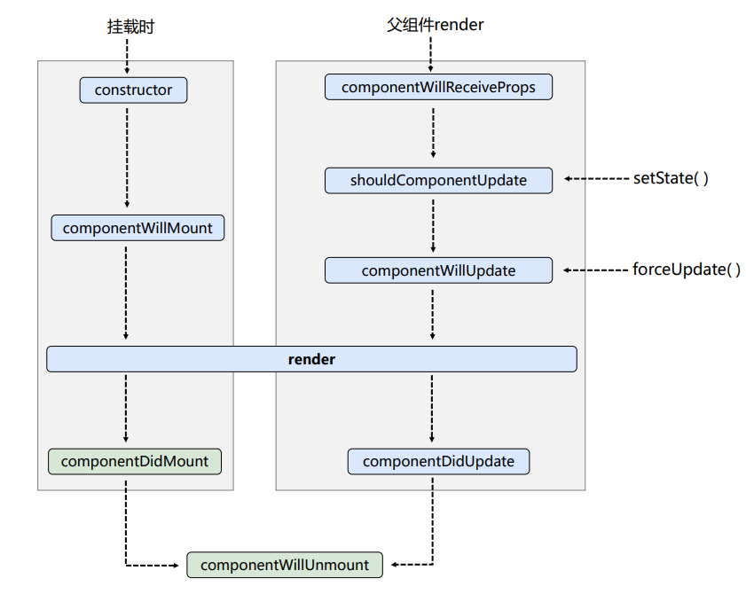
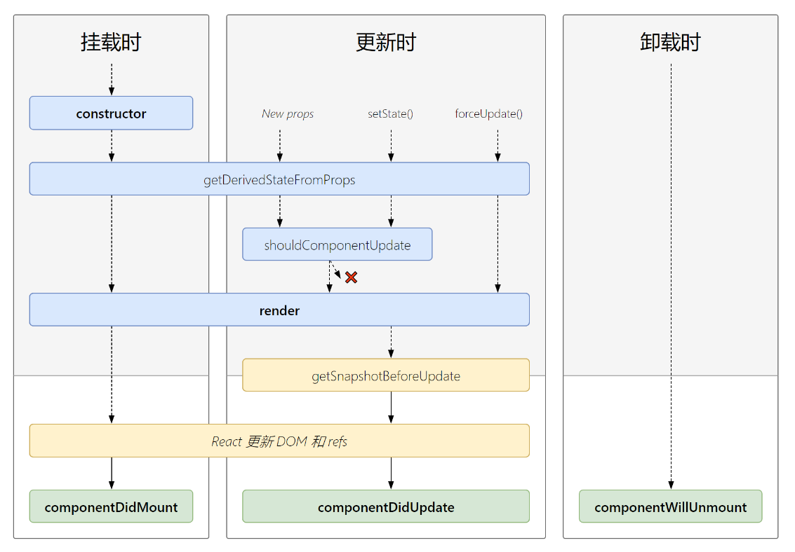

# React 基本使用

## React Hello Wrold

```html
<!-- 此处一定要写babel -->

<script type="text/babel">
  //1.创建虚拟DOM
  const VDOM = <h1>Hello,React</h1>;

  //2.渲染虚拟DOM到页面
  ReactDOM.render(VDOM, document.getElementById("app"));
</script>
```

## 虚拟 DOM 的两种创建方式

1. `JSX 创建`

jsx 语法规则：

1. 标签中混入 JS 表达式时要用`{}`。
2. 样式的类名指定不要用 class，要用 className。
3. 内联样式，要用双括号包裹 key:value 的形式去写
4. 只有一个根标签
5. 标签必须闭合
6. 标签首字母,若`小写字母开头`，则将该标签转为 html 中同名元素，若 html 中无该标签对应的同名元素，则报错。`若大写字母开头`，react 就去渲染对应的组件，若组件没有定义，则报错

```jsx
//1.创建虚拟DOM
const VDOM = (
  <h1 id="title">
    <span>Hello,React</span>
  </h1>
);
//2.渲染虚拟DOM到页面
ReactDOM.render(VDOM, document.getElementById("app"));
```

2. `JS 创建`

```js
//1.创建虚拟DOM
const VDOM = React.createElement(
  "h1",
  { id: "title" },
  React.createElement("span", {}, "Hello,React")
);
//2.渲染虚拟DOM到页面
ReactDOM.render(VDOM, document.getElementById("app"));
```

## 函数式组件 和 类式组件

### 函数式组件

```jsx
function MyComponent() {
  //此处的this是undefined，因为babel编译后开启了严格模式
  console.log(this);
  return <h2>我是创建函数式组件</h2>;
}
ReactDOM.render(<MyComponent />, document.getElementById("app"));
```

### 类式组件

```jsx
class MyComponent extends React.Component {
  //render 在 MyComponent 的原型对象上，供实例使用
  render() {
    //render中的this 指向 MyComponent的实例对象
    console.log("render中的this:", this);
    return <h2>我是类式组件</h2>;
  }
}
ReactDOM.render(<MyComponent />, document.getElementById("app"));
```

## 组件实例属性 state、props、refs

### state

注意点：

1. `this 的指向`可以在 constructor 中用 bind 改变指向，也可以在类上面通过 fn = 箭头函数的形式修改
2. `render 更新`需要通过 调用 setState 更新更新 state

```jsx
class Weather extends React.Component {
  render() {
    const { isHot, wind } = this.state;
    return (
      <h1 onClick={this.changeWeather}>
        今天天气很{isHot ? "炎热" : "凉爽"}，{wind}
      </h1>
    );
  }

  changeWeather = () => {
    const isHot = this.state.isHot;
    this.setState({ isHot: !isHot });
  };
}
```

### props

1. 注意 props 的传入方式，如何限制类型，以及如何函数式如何使用

```jsx
class Person extends React.Component {
  // 2. props类型检查
  //对标签属性进行类型、必要性的限制
  static propTypes = {
    name: PropTypes.string.isRequired,
    sex: PropTypes.string,
    age: PropTypes.number,
  };

  // 2. props 默认值
  //指定默认标签属性值
  static defaultProps = {
    sex: "男",
    age: 18,
  };

  render() {
    // 1. props基本使用
    const { name, age, sex } = this.props;
    return (
      <ul>
        <li>姓名：{name}</li>
        <li>性别：{sex}</li>
        <li>年龄：{age + 1}</li>
      </ul>
    );
  }
}

// 3. props限制的另外一种写法
// 对标签属性进行类型、必要性的限制
// Person.propTypes = {
//   name: PropTypes.string.isRequired,
//   sex: PropTypes.string,
//   age: PropTypes.number,
//   speak: PropTypes.func, //限制speak为函数
// };
//指定默认标签属性值
// Person.defaultProps = {
//   sex: "男",
//   age: 18,
// };

ReactDOM.render(
  // props 传入方式1
  <Person name="jerry" age={19} sex="男" />,
  document.getElementById("app1")
);

const p = { name: "老刘", age: 18, sex: "女" };
// props 传入方式2
ReactDOM.render(<Person {...p} />, document.getElementById("app2"));
```

2. 函数式组件用法

```jsx
function Person(props) {
  const { name, age, sex } = props;
  return (
    <ul>
      <li>姓名：{name}</li>
      <li>性别：{sex}</li>
      <li>年龄：{age}</li>
    </ul>
  );
}
Person.propTypes = {
  name: PropTypes.string.isRequired,
  sex: PropTypes.string,
  age: PropTypes.number,
};

//指定默认标签属性值
Person.defaultProps = {
  sex: "男", //sex默认值为男
  age: 18, //age默认值为18
};
```

### refs

```jsx
class Demo extends React.Component {
  myRef = React.createRef();
  showData = () => {
    // 1. 字符串形式的ref使用
    const { input1 } = this.refs;

    // 2. 回调函数形式的ref
    const { input2 } = this;

    // 3. createRef的使用
    this.myRef.current;
  };

  render() {
    return (
      <div>
        {/* 1. 字符串形式的ref */}
        <input ref="input1" type="text" placeholder="点击按钮提示数据" />
        {/* 回调函数形式的ref */}
        <input
          ref={(c) => (this.input2 = c)}
          type="text"
          placeholder="点击按钮提示数据"
        />
        <input ref={this.myRef} type="text" placeholder="点击按钮提示数据" />
        &nbsp;
        <button onClick={this.showData}>点我提示左侧的数据</button>
      </div>
    );
  }
}
```

## 组件的生命周期

### 旧的生命周期

1. 初始化阶段: 由 ReactDOM.render()触发---初次渲染
   1. constructor()
   2. componentWillMount()
   3. render()
   4. componentDidMount() `常用` 一般在这个钩子中做一些初始化的事
2. 更新阶段: 由组件内部 this.setSate()或父组件 render 触发
   1. shouldComponentUpdate()
   2. componentWillUpdate()
   3. render()
   4. componentDidUpdate()
3. 卸载组件: 由 ReactDOM.unmountComponentAtNode()触发
   1. componentWillUnmount() `常用` 一般在这个钩子中做一些收尾的事



### 新的生命周期

1. 初始化阶段: 由 ReactDOM.render()触发---初次渲染
   1. constructor()
   2. `getDerivedStateFromProps` 若 state 的值在任何时候都取决于 props，那么可以使用 getDerivedStateFromProps
   3. render()
   4. componentDidMount() =====> 常用
      一般在这个钩子中做一些初始化的事
2. 更新阶段: 由组件内部 this.setSate()或父组件重新 render 触发
   1. `getDerivedStateFromProps`
   2. shouldComponentUpdate()
   3. render()
   4. `getSnapshotBeforeUpdate` 在更新之前获取快照，`返回值可以在 componentDidUpdate 第三个参数中获取到 `
   5. componentDidUpdate()
3. 卸载组件: 由 ReactDOM.unmountComponentAtNode()触发
   1. componentWillUnmount() =====> 常用一般在这个钩子中做一些收尾的事



## 路由组件的 lazyLoad

```js
	//1.通过React的lazy函数配合import()函数动态加载路由组件 ===> 路由组件代码会被分开打包
	const Login = lazy(()=>import('@/pages/Login'))

	//2.通过 <Suspense> 指定在加载得到路由打包文件前显示一个自定义loading界面
	<Suspense fallback={<h1>loading.....</h1>}>
        <Switch>
            <Route path="/xxx" component={Xxxx}/>
            <Redirect to="/login"/>
        </Switch>
    </Suspense>
```
