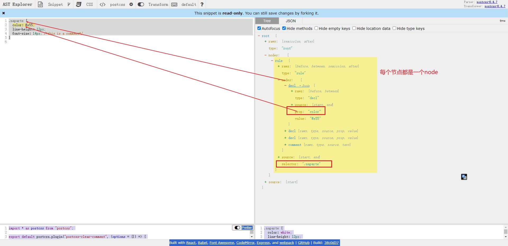
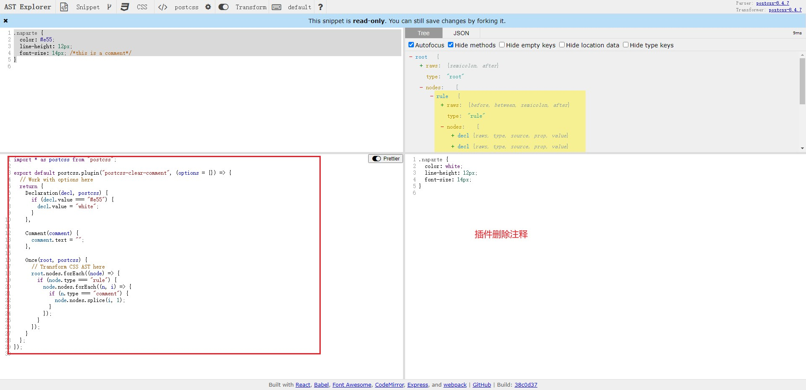

# PostCss

## 什么是 PostCSS？

- PostCSS is a tool for transforming styles with JS plugins. These plugins can lint your CSS, support variables and mixins, transpile future CSS syntax, inline images, and more.
- PostCSS 是一个通过 JS 插件转换样式的工具。这些插件可以检查您的 CSS、支持变量和混入、转译未来的 CSS 语法、内联图像等等
- 原理说明
- 

## 与 Sass、LESS、Stylus 的区别

1. Sass、LESS，Stylus 通过一定的语法、方法、函数，经过预先编译生成符合浏览器的 css 格式；称之为预处理器
2. PostCSS 本身是一个功能比较单一的工具。它提供了一种方式用 JavaScript 代码来处理 CSS。它负责把 CSS 代码解析成抽象语法树结构（Abstract Syntax Tree，AST），再交由插件来进行处理

## 举个例子

- 在线解析地址
- https://astexplorer.net/#/2uBU1BLuJ1

```css
.zijieyuan {
  color: #e55;
  line-height: 12px;
  font-size: 14px; /*this is a comment*/
}
```

> 解析出来的 json

```json
{
  "raws": {
    "semicolon": false,
    "after": "\n"
  },
  "type": "root",
  "nodes": [
    {
      "raws": {
        "before": "",
        "between": " ",
        "semicolon": true,
        "after": "\n"
      },
      "type": "rule",
      "nodes": [
        {
          "raws": {
            "before": "\n  ",
            "between": ": "
          },
          "type": "decl",
          "source": {
            "inputId": 0,
            "start": {
              "offset": 13,
              "line": 2,
              "column": 3
            },
            "end": {
              "offset": 24,
              "line": 2,
              "column": 14
            }
          },
          "prop": "color",
          "value": "#e55"
        },
        {
          "raws": {
            "before": "\n  ",
            "between": ": "
          },
          "type": "decl",
          "source": {
            "inputId": 0,
            "start": {
              "offset": 28,
              "line": 3,
              "column": 3
            },
            "end": {
              "offset": 45,
              "line": 3,
              "column": 20
            }
          },
          "prop": "line-height",
          "value": "12px"
        },
        {
          "raws": {
            "before": "\n  ",
            "between": ": "
          },
          "type": "decl",
          "source": {
            "inputId": 0,
            "start": {
              "offset": 49,
              "line": 4,
              "column": 3
            },
            "end": {
              "offset": 64,
              "line": 4,
              "column": 18
            }
          },
          "prop": "font-size",
          "value": "14px"
        },
        {
          "raws": {
            "before": " ",
            "left": "",
            "right": ""
          },
          "type": "comment",
          "source": {
            "inputId": 0,
            "start": {
              "offset": 66,
              "line": 4,
              "column": 20
            },
            "end": {
              "offset": 86,
              "line": 4,
              "column": 40
            }
          },
          "text": "this is a comment"
        }
      ],
      "source": {
        "inputId": 0,
        "start": {
          "offset": 0,
          "line": 1,
          "column": 1
        },
        "end": {
          "offset": 88,
          "line": 5,
          "column": 1
        }
      },
      "selector": ".zijieyuan"
    }
  ],
  "source": {
    "inputId": 0,
    "start": {
      "offset": 0,
      "line": 1,
      "column": 1
    }
  },
  "inputs": [
    {
      "hasBOM": false,
      "css": ".zijieyuan {\n  color: #e55;\n  line-height: 12px;\n  font-size: 14px; /*this is a comment*/\n}\n",
      "id": "<input css SGU3s_>"
    }
  ]
}
```

- 

## 示例：实现一个插件删除 CSS 注释

> 插件格式

```javascript
module.exports = (opts = {}) => {
  // 此处可对插件配置opts进行处理
  return {
    postcssPlugin: "postcss-pluginname", // 插件名字，以postcss-开头

    Once(root, postcss) {
      // 此处root即为转换后的AST，此方法转换一次css将调用一次
    },

    Declaration(decl, postcss) {
      // postcss遍历css样式时调用，在这里可以快速获得type为decl的节点(请参考第二节的AST对象)
    },

    Declaration: {
      color(decl, postcss) {
        // 可以进一步获得decl节点指定的属性值，这里是获得属性为color的值
      },
    },

    Comment(comment, postcss) {
      // 可以快速访问AST注释节点（type为comment）
    },

    AtRule(atRule, postcss) {
      // 可以快速访问css如@media，@import等@定义的节点（type为atRule）
    },
  };
};
```

```javascript
const postcss = require("postcss");
postcss([
  {
    postcssPlugin: "postcss-clear-comment",

    Declaration(decl, postcss) {
      if (decl.value === "#ffffff") {
        decl.value = "white";
      }
    },

    // 这里是不是注释节点清空；但是会留下 /**/ 这样一个节点
    Comment(comment) {
      comment.text = "";
    },

    // 删除 /**/ 这种节点
    Once(root, postcss) {
      // Transform CSS AST here
      root.nodes.forEach((node) => {
        if (node.type === "rule") {
          node.nodes.forEach((n, i) => {
            if (n.type === "comment") {
              node.nodes.splice(i, 1);
            }
          });
        }
      });
    },
  },
])
  .process(
    `
    .zijieyuan {
      color: #e55;
      line-height: 12px;
      font-size: 14px; /*this is a comment*/
    }
    `
  )
  .then((result) => {
    console.log(result);
  });
```

- 

## PostCSS 插件市场

- https://www.postcss.parts/
