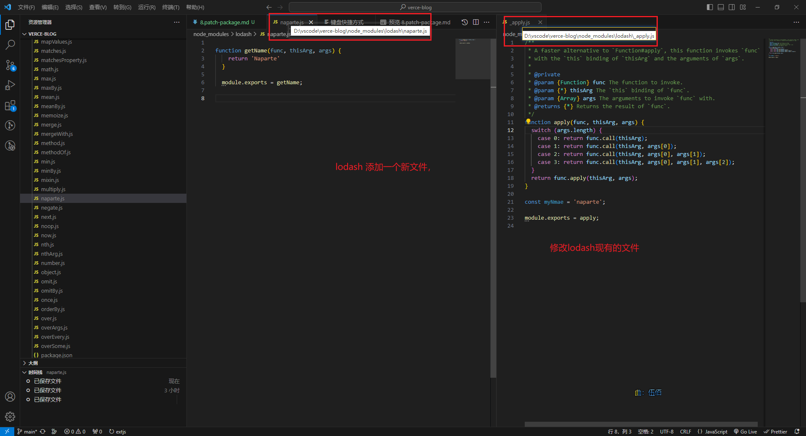
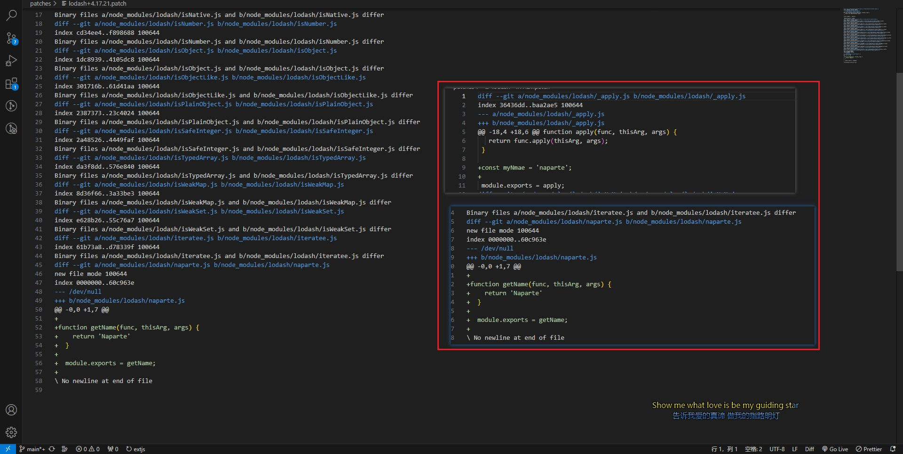

# patch-package

## patch-package 是什么？

> 功能介绍

- 修复第三方包的 bug：开发人员可以使用 patch-package 快速修复第三方包中的 bug，而无需等待原始包的维护者发布修复版本。
- 添加自定义功能：通过 patch-package，开发人员可以添加自定义功能到第三方包中，而无需修改原始包的源码。
- 版本控制：patch-package 生成的补丁文件可以与代码版本控制系统一起使用，从而确保团队成员之间对第三方包的修改得到有效管理和共享。
- 避免 fork：使用 patch-package 可以避免因为需要修改第三方包而进行 fork，从而减少维护成本和复杂度。

> patch-package 的原理

- patch-package 的原理是基于 npm 包的本地补丁。当开发人员使用 patch-package 时，它会创建一个补丁文件（以 .patch 结尾），该补丁文件包含了对第三方包的修改内容。然后，patch-package 会在 npm install 时自动应用这些补丁，从而实现对第三方包的修改。

## patch-package 的功能使用

```shell

# 安装依赖
yarn add patch-package -D

# 打补丁后面跟一个包名；会生成一个patchs文件目录
yarn patch-package package-name
# npx patch-package package-name


# 应用补丁
yarn patch-packag
# npx patch-package

```

> API 列表

| 参数                            | 说明                                                               |
| ------------------------------- | ------------------------------------------------------------------ |
| --create-issue                  | 当应用补丁时，如果发现问题，自动创建一个 GitHub issue 来报告问题。 |
| --use-yarn                      | 使用 yarn 而不是 npm 来安装依赖和应用补丁。                        |
| --exclude `<regexp>`            | 排除匹配指定正则表达式的文件，这些文件将不会被包含在补丁中。       |
| --include `<regexp> `           | 只包含匹配指定正则表达式的文件，其他文件将不会被包含在补丁中。     |
| --case-sensitive-path-filtering | 在应用补丁时，对文件路径进行大小写敏感的过滤。                     |
| --patch-dir                     | 指定存储补丁文件的目录，而不是默认的 `patches` 目录。              |

## patch-package 的原理

> patches 文件的生成

- 首先 patch-package 会创建一个临时目录
- 然后在这个目录写入一个 package.json 文件，dependencies 就是命令行参数指定的包名
- 然后它会在这个目录下执行 yarn install 或者 npm install（patch-package 现在不支持 pnpm）
- 之后就进行 git 的 init、add、commit，生成一个基础的 commit。
- 然后把现在 node_modules 目录下的这个被修改过的包复制过去
- 之后再 git add，然后执行 git diff，就能拿到改动的 diff

> 应用 patches 的内容

- patches 文件里记录了对哪几行做了新增，哪几行做了删除，哪几行做了修改。
- 应用这个 patches 文件的话，不就是找到对应文件的对应行数，做反向的操作
- 它读取 patches 文件之后会进行 parse：
- 这个 parse 的实现就是对每一行的字符串做判断，进行不同的处理：
- 最终能得到一个包含 diff 信息的对象，包含了对什么文件的哪些行做了什么修改：
- 之后对不同的类型做不同的操作就可以了

## 使用示例:修复第三方包中的 bug

> 修改 npm 包

- 

> 生成差异文件

- 

> 应用差异文件

- 
